# Telephile

Telephile is an online TV series website where users can create an account and leave reviews for different TV series. Users can interact with reviews by leaving comments and liking posts and reply to other comments others have commented on their own reviews. 

You can find the live site [Here](https://telephile.herokuapp.com/).
####

.png)
&nbsp;

# Purpose
I built this website as my fourth project for the code institutes full stack development and e-commerce applications course. 
I built this website from scratch using the knowledge I gained from the course where I studied the basics of Python, HTML, Javascript and CSS.

# Target audience
* Tv Lovers
* Writers 
* Bloggers

# User Experience 

 

## Site Aims

* Provide Tv lovers with a forum to post reviews of any Tv series they have watched and interact with other Tv enthusiasts.
* Allow users to find different Tv series from the different choice of series categories on the site.
* Allow users to comment on reviews and reply to any on their own.
* Allow users to like other user's posts.
* Provide the site admin with the ability to approve and disapprove posts and comments to promote a safe space for users. 

# Design 

 

## Agile Methodology 
The agile methodology was implemented in the design of this project. The project was planned on github using the project board feature.
* You can find the project board [Here](https://github.com/users/Mcdaid101/projects/2/views/1).
* The project board consists of three sections: 
* 1. Todo 
* 2. In progress 
* 3. Done.
Each user story was drawn up in the issues section of gihub and passed on to the kanban where once  added to the project board it was placed in the todo section, when in progress the second section and when implemented and complete in the third. 
 

## User stories
### First iteration
* 1. Manage Posts. As a site admin I can create, read, update and delete comments and posts so that I can manage what is viewed on the site.
* 2. Create drafts. As a site admin I can create drafts so that I can save my posts and continue writing them later.
* 3. Approve of comments. As a site admin I can approve of comments before they are posted so that I can make sure they are not inappropriate or abusive.
### Second iteration
* 1. Post reviews. As a user I can post reviews on the site so that I can share my reviews with the site community.
* 2. View Posts. As a User I can open up posts so that I can read the article within it and view comments.
* 3. Paginated Posts. As a site user I can view a paginated list of posts so that I can easily select a post to view.
* 4. Account registration. As a site user I can register for an account so that I can comment and upvote and downvote on posts.
* 5. Log out. As a site user I can log out of the site so that I do not remain logged in and people do not get access to my account.
### Third iteration
* 1. Like functionality. As a user I can like and unlike posts so that I can show I like a post.
* 2. View likes. As a site user I can see how many likes a post has so that I can see how popular a post is.
* 3. Comments on Posts. As a user I can comment so that I can share my opinion on a series and interact with other site users.

### Future features 
* As a user be able to save reviews and access your own section of saved reviews so that you can keep track of ones you like. 
* As a user be able to upload your own images on your review post to show pictures of the series you are reviewing.
* As a user I can create my own profile, complete with my likes, comments and bio about myself to showcase myself better on the platform. 
 

## Wireframes and Schema

Desktop Wireframes

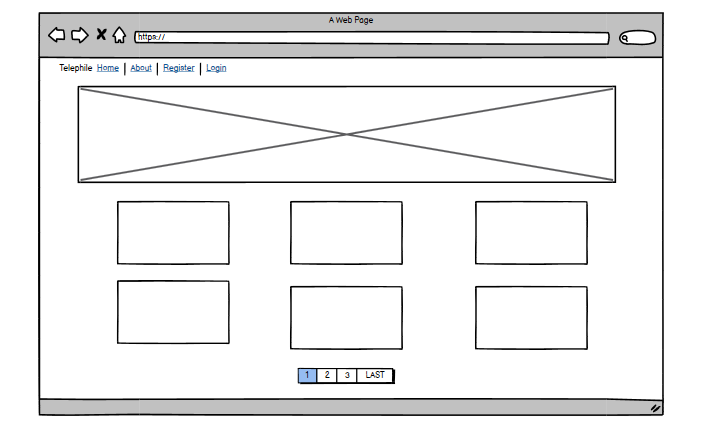

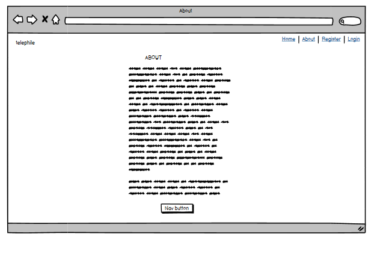

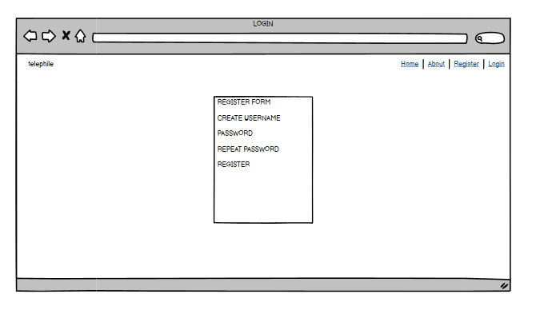

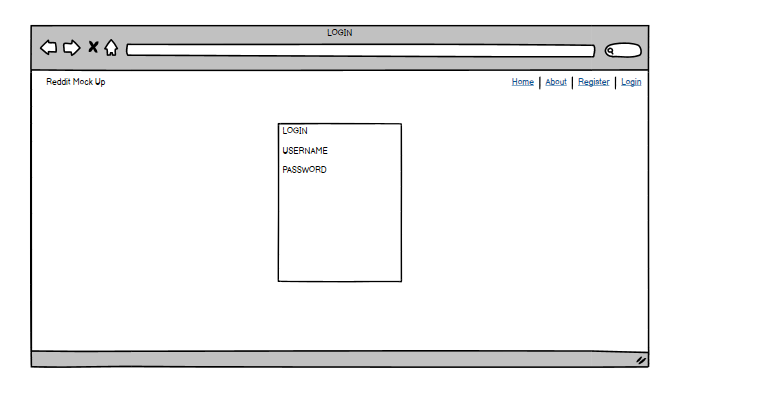

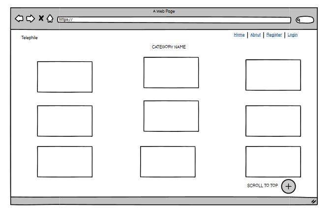

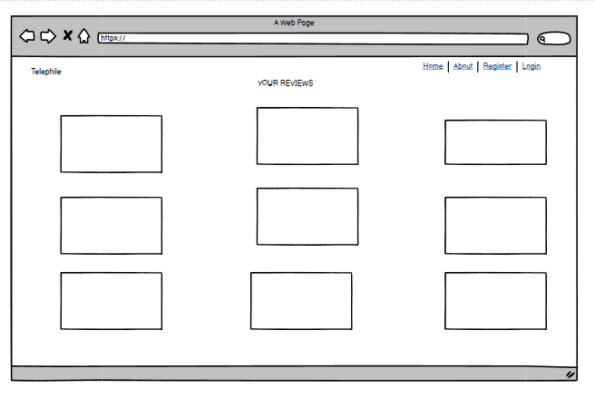

Mobile and Tablet Wireframes

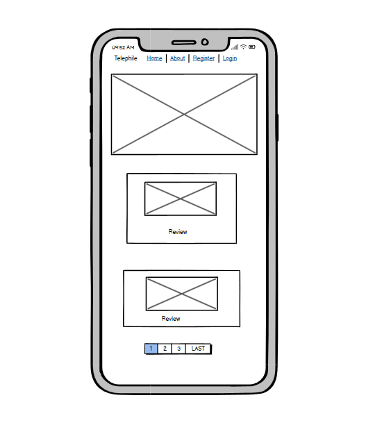

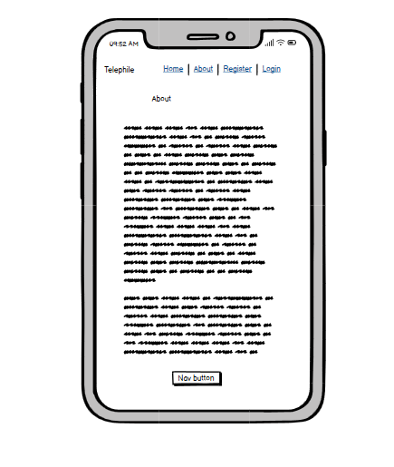

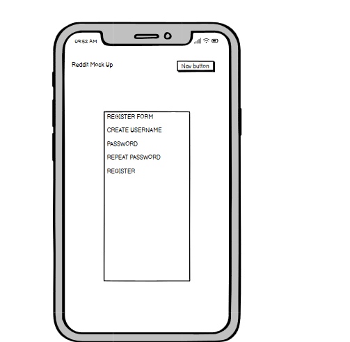

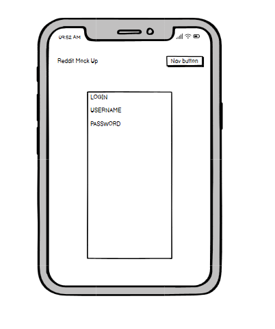

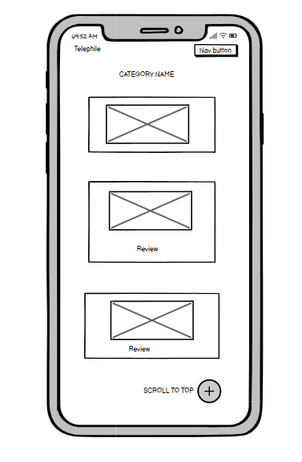

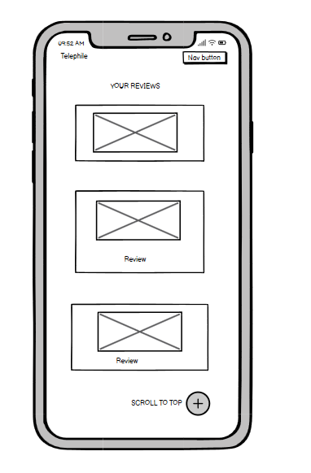

Database Schema

## Design choices 
 

### Colour scheme
The colour scheme of Telephile is a simple black and white. These were chosen as they contrast each other well and they helped me implement the light and dark mode where users can choose which colour to view the site in.

### Font 
The font family for the website is 'roboto, condensed' from google fonts, this was chosen as it is easy to read and perfect for an article along with a blog site in general. 

## Features
 

### Nav bar
To navigate the site Users use the nav bar at the top of each page. What appears on the nav bar depends on if the user is authenticated or not. (if the user is signed up)
* Signed out 

* Signed in
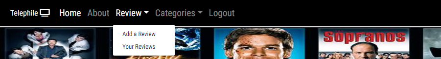

### Footer
Similar to the nav bar the footer appears on each page and has a sticky effect. The footer contains links to the site's social media pages and has a light/dark mode button so users can choose which way to view the site. 

### Home page 
The home page is the first page the user will see when visiting the site, it contains the nav bar and footer and a hero image of classic tv series along with a welcome message which tells the user of reviews below they should check out and sign up to create their own. The reviews below are paginated in reviews of 6. 
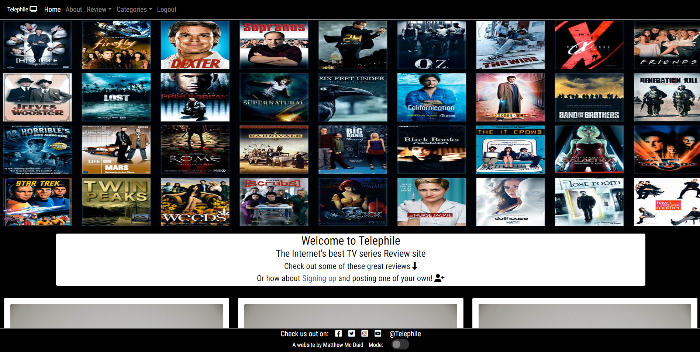

### About page 
The about page contains a card which tells the user about the site and what it's values are. It has a home button at the end of the text to redirect the user to the home page and to entice them to explore further once they have found out what the site is about. 
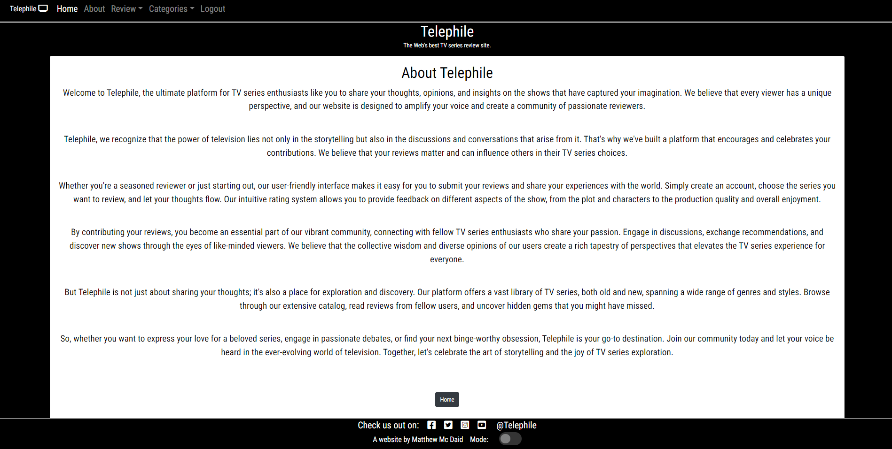

### Post a review
This page is accessed through the nav bar under the "Review" drop down. This page allows the user to post their own review and give it their own title, content and pick which category it belongs in. 
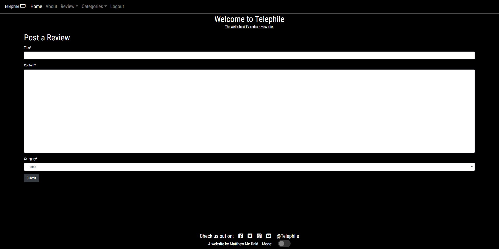

### Your reviews
This page is accessed through the nav bar under the "Review" drop down. This page allows users to view the posts they have posted themselves. This page is only accessible once a user has signed up and is logged in. 
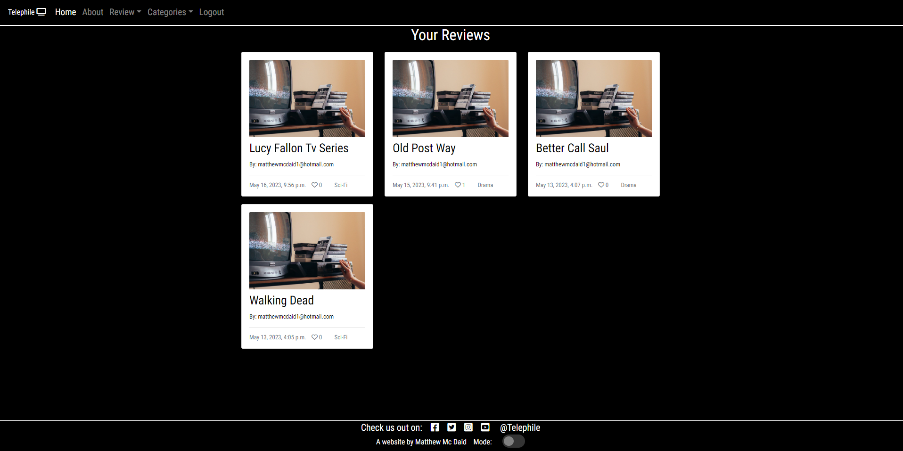

# Technology Used 
 

## Languages 
* Python
* HTML
* CSS 
* Javascript
* Django framework
 

## Tools and Frameworks
* Git 
* Github 
* Vs Code IDE in browser
* Django
* Techsini Multi Device Mockup Generator used in this readme to display an image of the website on different devices 
* Heroku -  Hosts live site 
* ElephantSQL - HOsts database
* Bootstrap 4 - Used for site structure and making the site responsive
* Basimiq - Created wireframes 
* Cloudinary + Whitenoise - Hosts and displays static files and images for the site

# Bugs 

* 
 

* 
 

* No bugs remained after this. 
 

# Testing and validation

 

I have manually tested this project by doing the following:

* Passed the project through a pep8 linter and confirmed there is no problems.
* Tested in my gitpod terminal and the Heroku terminal.
* Tested each user story to make sure each one passes. 

Pep8
* No errors were returned from Pep8online.com or from extendsclass.com/pythontester.

 

## Manual Testing

## First time stories 
* As a first time user: I want to be able  
Testing done to make sure that 

First time user 1

| **Feature** | **Action** | **Expected Result** | **Actual Result** |
|-------------|------------|---------------------|-------------------|
| | |   | Works as expected |

 
 

* As a first time user:    
 Testing done to ensure that 

First time user 2

| **Feature** | **Action** | **Expected Result** | **Actual Result** |
|-------------|------------|---------------------|-------------------|
|  |  |  | Works as expected |

 
 

* As a first time user: I want to be able to  
  Testing done to ensure that 

First time user 3

| **Feature** | **Action** | **Expected Result** | **Actual Result** |
|-------------|------------|---------------------|-------------------|
| | |  | Works as expected |

 
 

* As a first time user: I want to be able to   
 Testing done to ensure that 

First time user 4

| **Feature** | **Action** | **Expected Result** | **Actual Result** |
|-------------|------------|---------------------|-------------------|
||  |  | Works as expected |

 
 

* As a first time user: I want   
 Testing done to ensure that 

First time user 5

| **Feature** | **Action** | **Expected Result** | **Actual Result** |
|-------------|------------|---------------------|-------------------|
| | |  | Works as expected |

 
 

* As a first time user: I want  
Testing done to ensure the

First time user 6

| **Feature** | **Action** | **Expected Result** | **Actual Result** |
|-------------|------------|---------------------|-------------------|
| |   |  | Works as expected |

 
 

* As a first time user: I want to  
 Testing done to ensure that 

First time user 7

| **Feature** | **Action** | **Expected Result** | **Actual Result** |
|-------------|------------|---------------------|-------------------|
|  |  |  | Works as expected |

 
 

*  As a first time user: I want to  
 Testing done to ensure that 

First time user 8

| **Feature** | **Action** | **Expected Result** | **Actual Result** |
|-------------|------------|---------------------|-------------------|
|  |  |  | Works as expected |

 
 

* As a first time user: I want to be able to   
Testing done to ensure that 

First time user 9

| **Feature** | **Action** | **Expected Result** | **Actual Result** |
|-------------|------------|---------------------|-------------------|
| |  |  | Works as expected |

 
 

## Returning stories

* As a returning user: I want to be able to  
 Testing done to ensure that 

Returning User 1

| **Feature** | **Action** | **Expected Result** | **Actual Result** |
|-------------|------------|---------------------|-------------------|
|  |  |  | Works as expected |

 
 

* As a returning user: I want to be able to   
Testing done to ensure that 

Returning user 2

| **Feature** | **Action** | **Expected Result** | **Actual Result** |
|-------------|------------|---------------------|-------------------|
| |  |   | |

 
 

## Owner stories 
* As the site owner:   
Testing done to ensure that 

Site owner 1

| **Feature** | **Action** | **Expected Result** | **Actual Result** |
|-------------|------------|---------------------|-------------------|
|  | | | Works as expected |

 
 

* As the site owner:    
Testing done to ensure that 

Site owner 2

| **Feature** | **Action** | **Expected Result** | **Actual Result** |
|-------------|------------|---------------------|-------------------|
| |  |   | Works as expected |

 
 

* As the site owner: I want users to    
Testing done to ensure 

Site owner 3

| **Feature** | **Action** | **Expected Result** | **Actual Result** |
|-------------|------------|---------------------|-------------------|
|  |  |  | Works as expected |

 

# Deployment 

## Creating this project
This project was created by navigating to the Code Institute's Gitpod student template and clicking the 'use this template' button. I then inputted the repository name "telephile" and included all branches. With the repository now created, I used the browser version of Vs Code to create the project. 
 

I used the following commands throughout this project:
* Git add . - This added my file to the staging area to be committed
* Git commit -m - This command committed any changes to the local repository along with a message
* Git push - pushed my changes to the github repository and to Heroku 
* git reset --hard HEAD^ - This removed my last commit 
* python3 manage.py runserver - This ran my code in the terminal
* python3 manage.py makemigrations - This made my migrations
* python3 manage.py migrate - This migrated my changes to my databases

## Heroku
 This website is deployed on the Code Institute's mock terminal on Heroku

### Steps for deployment 
* Fork or clone this repository
* Created a new heroku app through build app
* Set the buildpacks to Python and NodeJs in that specific order
* Linked the heroku app to the repository via github
* Clicked automatic deploys so each git push would automatically go to the heroku app
* This was ideal for testing so I could see what the game looked like on the Heroku terminal with each git push

# Credits 

## Code 
* 
* 
* 

## Media 
* 
* 

## Acknowledgements 
* I would like to thank my mentor Ronan Mc Clelland for his help and guidance while I built this project.
* I would like to thank my family for their love and support.
* And finally my girlfriend for her advice on my site's style. 