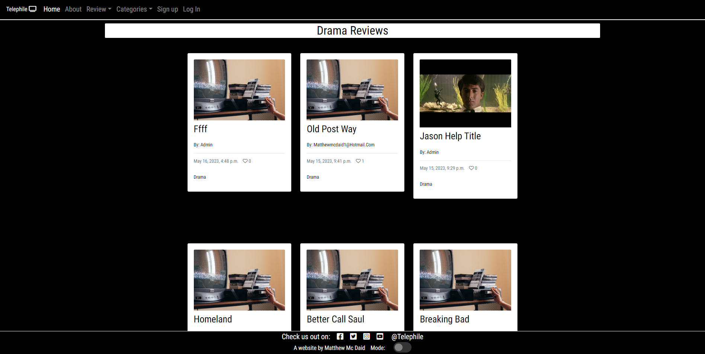
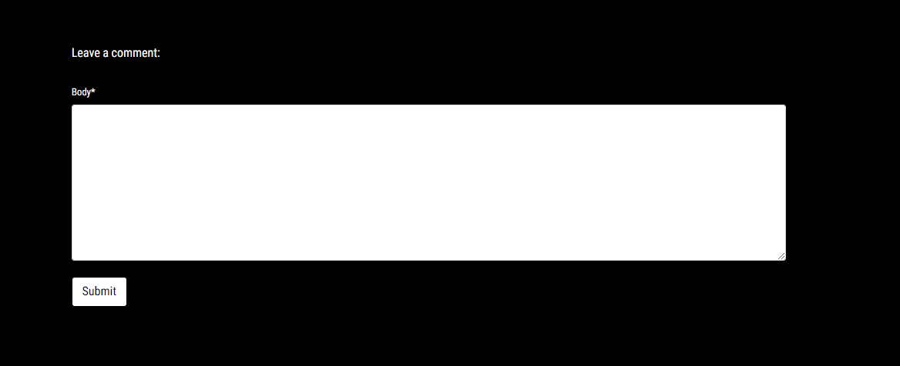

# Telephile

Telephile is an online TV series website where users can create an account and leave reviews for different TV series. Users can interact with reviews by leaving comments and liking posts and reply to other comments others have commented on their own reviews. 

You can find the live site [Here](https://telephile.herokuapp.com/).
####

.png)
&nbsp;

# Purpose
I built this website as my fourth project for the code institutes full stack development and e-commerce applications course. 
I built this website from scratch using the knowledge I gained from the course where I studied the basics of Python, HTML, Javascript and CSS.

# Target audience
* Tv Lovers
* Writers 
* Bloggers

# User Experience 

 

## Site Aims

* Provide Tv lovers with a forum to post reviews of any Tv series they have watched and interact with other Tv enthusiasts.
* Allow users to find different Tv series from the different choice of series categories on the site.
* Allow users to comment on reviews and reply to any on their own.
* Allow users to like other user's posts.
* Provide the site admin with the ability to approve and disapprove posts and comments to promote a safe space for users. 

# Design 

## Agile Methodology 
The agile methodology was implemented in the design of this project. The project was planned on github using the project board feature.
* You can find the project board [Here](https://github.com/users/Mcdaid101/projects/2/views/1).
* The project board consists of three sections: 
* 1. Todo 
* 2. In progress 
* 3. Done.
* Each user story was drawn up in the issues section of gihub and passed on to the kanban where once  added to the project board it was placed in the todo section, when in progress the second section and when implemented and complete in the third. 
 

## User stories
### First iteration
* 1. Manage Posts. As a site admin I can create, read, update and delete comments and posts so that I can manage what is viewed on the site.
* 2. Create drafts. As a site admin I can create drafts so that I can save my posts and continue writing them later.
* 3. Approve of comments. As a site admin I can approve of comments before they are posted so that I can make sure they are not inappropriate or abusive.
### Second iteration
* 1. Post reviews. As a user I can post reviews on the site so that I can share my reviews with the site community.
* 2. View Posts. As a User I can open up posts so that I can read the article within it and view comments.
* 3. Paginated Posts. As a site user I can view a paginated list of posts so that I can easily select a post to view.
* 4. Account registration. As a site user I can register for an account so that I can comment and upvote and downvote on posts.
* 5. Log out. As a site user I can log out of the site so that I do not remain logged in and people do not get access to my account.
### Third iteration
* 1. Like functionality. As a user I can like and unlike posts so that I can show I like a post.
* 2. View likes. As a site user I can see how many likes a post has so that I can see how popular a post is.
* 3. Comments on Posts. As a user I can comment so that I can share my opinion on a series and interact with other site users.

### Future features 
* As a user be able to save reviews and access your own section of saved reviews so that you can keep track of ones you like. 
* As a user be able to upload your own images on your review post to show pictures of the series you are reviewing.
* As a user I can create my own profile, complete with my likes, comments and bio about myself to showcase myself better on the platform. 
 

## Wireframes and Schema

Desktop Wireframes

Mobile and Tablet Wireframes

Database Schema

## Design choices 
 

### Colour scheme
The colour scheme of Telephile is a simple black and white. These were chosen as they contrast each other well and they helped me implement the light and dark mode where users can choose which colour to view the site in.

### Font 
The font family for the website is 'roboto, condensed' from google fonts, this was chosen as it is easy to read and perfect for an article along with a blog site in general. 

## Features
 

### Nav bar
To navigate the site Users use the nav bar at the top of each page. What appears on the nav bar depends on if the user is authenticated or not. (if the user is signed up)
* Signed out 

* Signed in

### Footer
Similar to the nav bar the footer appears on each page and has a sticky effect. The footer contains links to the site's social media pages and has a light/dark mode button so users can choose which way to view the site. 

### Home page 
The home page is the first page the user will see when visiting the site, it contains the nav bar and footer and a hero image of classic tv series along with a welcome message which tells the user of reviews below they should check out and sign up to create their own. The reviews below are paginated in reviews of 6. 

### About page 
The about page contains a card which tells the user about the site and what it's values are. It has a home button at the end of the text to redirect the user to the home page and to entice them to explore further once they have found out what the site is about. 

### Post a review
This page is accessed through the nav bar under the "Review" drop down. This page allows the user to post their own review and give it their own title, content and pick which category it belongs in. Once the user has successfully posted a review they will be notified with an alert
* If user is logged in and authenticated 

* If user is not logged in and not authenticated

### Your reviews
This page is accessed through the nav bar under the "Review" drop down. This page allows users to view the posts they have posted themselves. This page is only accessible once a user has signed up and is logged in. 

### Categories
This page contains the articles which are listed under each category type. Drama, Sci-Fi, Fantasy, Comedy and Documentary. The user clicks on the dropdown on the nav bar to choose which category they would like to see. The category page has a scroll to top button at the bottom of each page to bring users back up to the top quickly. 

### Sign up 
The sign up page contains a form for users to sign up for the site. Requiring them to create a username and password. 

### Log in
The log in page contains a login form for users to log in to. This requires their username and password they created when they signed up. Once a user logs in they are redirected to the home page and a notifiction will appearing notifying them that they have logged in. 

### Log out
The log out page contains a card which asks are the user sure they want to log out and the option to log out. Once a user logs in they are redirected to the home page and a notifiction will appearing notifying them that they have logged out. 

### Post detail
The post detail page is accessed by clicking on the cards of each post within the home page, categories or your reviews page. This page contains the posts content title and likes and comments. Users can read the posts content section and check out likes and comments and who wrote the article. 

### Comments
The users have the ability to comment on posts when they are logged in and authenticated. The option to comment will not be available until they are signed up and logged in. Once a user has commented they will be notified their comment has been submitted for approval by the admin team. 

### Likes
Users have the ability to like and unlike posts. The feature is found underneath the content section of each posts and is in the form of a love heart.

# Technology Used 
 

## Languages 
* Python
* HTML
* CSS 
* Javascript

 

## Tools and Frameworks
* Git 
* Github 
* Vs Code IDE in browser
* Django
* Postgres
* Techsini Multi Device Mockup Generator used in this readme to display an image of the website on different devices 
* Heroku -  Hosts live site
* Allauth - login and registration
* ElephantSQL - HOsts database
* Bootstrap 4 - Used for site structure and making the site responsive
* Basimiq - Created wireframes 
* Cloudinary + Whitenoise - Hosts and displays static files and images for the site

# Bugs 

* Was really struggling to make the user's review that were posted to be accessible in the post detail form. Using the form.cleaned_data[] method in "form.instance.slug = slugify(form.cleaned_data['title'])" in my add post view helped with this and fixed the bug. 
 

* When doing lighthouse testing my site was scoring very low, took me a while to realize some of the chrome add on's I was using such as adblocker were impacting it's performance. Switching to an incognito tab quickly got the score up and made testing the page easier. 
 

* When I deployed the site, none of my css or images were loading correctly. Installing whitespace fixed this. 

* No bugs remained after this. 
 

# Testing and validation

 

I have manually tested this project by doing the following:
* Passed the pages through the W3C HTML and CSS validators
* Passed the project through a pep8 linter and the Code Institute python checker and confirmed there is no problems.
* Tested in my gitpod terminal and the Heroku terminal.
* Tested each user story to make sure each one passes. 

W3C validations

Pep8
* No errors were returned from the code institute's python Linter or from extendsclass.com/pythontester.

Lighthouse testing
* At first my test results came up quite poor but after switching to an incognito window on chrome and downsizing the main hero image on the home page the site got a high score as seen in the images below. All pages got a similar result.
 

 

## Manual Testing

## First time stories 
* As a first time user: I want to be able to post a review on Telephile  
Testing done to make sure that users can post reviews.

First time user 1

| **Feature** | **Action** | **Expected Result** | **Actual Result** |
|-------------|------------|---------------------|-------------------|
| Add your own post| Once signed up and logged in, users can navigate to the add a review page and add a post. The post is successful ifthey receive an alert telling them so | The user receives an alert notifying them that their post is pending  | Works as expected |

 
 

* As a first time user: I want to be able to sign up and create an account  
 Testing done to ensure that users can sign up to the website.

First time user 2

| **Feature** | **Action** | **Expected Result** | **Actual Result** |
|-------------|------------|---------------------|-------------------|
| Create an account feature | Users can navigate to the sign up page and create an account  | Once the user signs up their account is created and they can log in and out as they please and make use of the rest of the site's features  | Works as expected |

 
 

* As a first time user: I want to be able to leave comments on other's posts  
  Testing done to ensure that users can comment on posts

First time user 3

| **Feature** | **Action** | **Expected Result** | **Actual Result** |
|-------------|------------|---------------------|-------------------|
|Comments | Users can comment underneath other users posts | Comments appear once they are posted and approved by the admin | Works as expected |

 
 

* As a first time user: I want to be able to view how many likes and comments are on a post   
 Testing done to ensure that the amount of likes and comments on a post appear underneath the post

First time user 4

| **Feature** | **Action** | **Expected Result** | **Actual Result** |
|-------------|------------|---------------------|-------------------|
|Amount of likes and comments | Navigate any posts page and find out how many users commented and liked the post underneath the image beside the author  | The amount of likes and comments appear underneath the post | Works as expected |

 
 

* As a first time user: I want to see what posts I have made  
 Testing done to ensure that the your reviews section shows the user's reviews.

First time user 5

| **Feature** | **Action** | **Expected Result** | **Actual Result** |
|-------------|------------|---------------------|-------------------|
| Your reviews section| navigate to the your reviews section to view the posts you have made | Your reviews appear in the your reviews section  | Works as expected |

 
 

## Returning stories

* As a returning user: I want to be able to log in without putting my details again  
Testing done to ensure each user can have their details remembered for login. 

Returning user 1

| **Feature** | **Action** | **Expected Result** | **Actual Result** |
|-------------|------------|---------------------|-------------------|
| Remember login details | Navigate to login page and click remmeber details | The user's login details will be remembered for next time | Works as expected |

 
 

* As a returning user: I want to be able to like posts I enjoy and have the option of unliking them if I want  
Testing done to ensure that users can like and unlike posts

Returning user 2

| **Feature** | **Action** | **Expected Result** | **Actual Result** |
|-------------|------------|---------------------|-------------------|
| Likes | Clicking the heart under a post liked the post and clicking it again unlikes it | The post is liked  | Works as expected |

 
 

## Owner stories 
* As the site owner: I want to be able to moderate what is posted on the site   
Testing done to ensure that the admin can approve and disapprove of what is posted on the site

Site owner 1

| **Feature** | **Action** | **Expected Result** | **Actual Result** |
|-------------|------------|---------------------|-------------------|
| Approve of and disapprove of posts and comments | Admin can approve and disapprove of users posts and comments, they will not get posted until they are approved| Posts and comments do not appear until approved | Works as expected |

 
 

* As the site owner: I want to be able to choose the category each post belongs in   
Testing done to ensure that posts can be placed in a specific category

Site owner 2

| **Feature** | **Action** | **Expected Result** | **Actual Result** |
|-------------|------------|---------------------|-------------------|
| Categorizing | Admin can choose which category a post belongs to | The category the admin chooses the post to be in, is which one it ends up in the category page  | Works as expected |

 
 

# Deployment 

## Creating this project
This project was created by navigating to the Code Institute's Gitpod student template and clicking the 'use this template' button. I then inputted the repository name "telephile" and included all branches. With the repository now created, I used the browser version of Vs Code to create the project. 
 

I used the following commands throughout this project:
* Git add . - This added my file to the staging area to be committed
* Git commit -m - This command committed any changes to the local repository along with a message
* Git push - pushed my changes to the github repository and to Heroku 
* git reset --hard HEAD^ - This removed my last commit 
* python3 manage.py runserver - This ran my code in the terminal
* python3 manage.py makemigrations - This made my migrations
* python3 manage.py migrate - This migrated my changes to my databases

## Heroku
 This website is deployed on Heroku

## Steps for deployment 
* Fork or clone this repository
* Linked the heroku app to the repository via github
* Clicked automatic deploys so each git push would automatically go to the heroku app
* This was ideal for testing so I could see what the site looked like on the Heroku terminal with each git push

 1. Create Django project and app 

* Install django using the command pip3 install 'django<4' gunicorn
* Then install the database libraries dj_database_url and psycopg2, using pip3 install dj_database_url psycopg2
* Install Cloudinary library to host any images using pip3 install dj3-cloudinary-storage
* Then create the requirements.txt file using the command pip3 freeze --local > requirements.txt
* Then created my Django project with the command django-admin startproject project_name .
* I created the Django app with the command python3 manage.py startapp app_name
* I used the commands python3 manage.py makemigrations and python3 manage.py migrate to migrate my changes.
* To test and run the project I used python3 manage.py runserver.

 2. Create Heroku app 

* I opened the heroku website and logged into my account
* I created a new app with the project name
* Select region as Europe
* Open the Resources section and select Heroku Postgres
* Open the Settings section and select Config VARS, then add the keys needed to start development DATABASE_URL/SECRET_KEY/CLOUDINARY_URL, with Config VARS you add: PORT: 8000 + DISABLE_COLLECTSTATIC: 1;

 3. Set up Django settings.py and necessary folders/files 

* Set up to connect the environment variables
         from pathlib import Path
         import os
         import dj_database_url
         from django.contrib.messages import constants as messages
         if os.path.isfile('env.py'):
         import env
         
* Inside INSTALLED_APPS I added the necessary apps

* For the database I replaced it with the following code

        DATABASES = {
        'default': dj_database_url.parse(os.environ.get('DATABASE_URL'))
        }
        
* For the static files I replaced it with the following code to conect to Cloudinary

      STATIC_URL = '/static/'
      STATICFILES_STORAGE = 'cloudinary_storage.storage.StaticHashedCloudinaryStorage'
      STATICFILES_DIRS = [os.path.join(BASE_DIR, 'static')]
      STATIC_ROOT = os.path.join(BASE_DIR, 'staticfiles')

      MEDIA_URL = '/media/'
      DEFAULT_FILE_STORAGE = 'cloudinary_storage.storage.MediaCloudinaryStorage'
      
* Create a Procfile and add the following text

web: gunicorn autoclassic.wsgi

<h3> 4. Final deployment. </h3>

* In settings.py set the DEBUG = False;
* In Heroku I went back to Settings > Config VARS and removed the DISABLE_COLLECTSTATIC var;
* In Heroku I navigated to the Deploy section;
* I clicked to connect to GitHub and searched for my repository for this project;
* I clicked on manual deploy to build the App;
* When finished, I clicked the View button, which redirected me to the live site.

  

# Credits
* W3schools provided me with the code for my scroll to top of page function and my dark/light mode button. 

## Media 
* Site's posts feature image if unprovided: [here](https://www.pexels.com/photo/retro-tv-set-on-concrete-surface-5721869/)
* Posts feature image if unprovided: [here](https://images.pexels.com/photos/10599961/pexels-photo-10599961.jpeg?auto=compress&cs=tinysrgb&w=1260&h=750&dpr=1)
* Home page hero image is [here]()

## Acknowledgements 
* I would like to thank my mentor Ronan Mc Clelland for his help and guidance while I built this project.
* I would like to thank my family for their love and support.
* And finally my girlfriend for her advice on my site's style. 